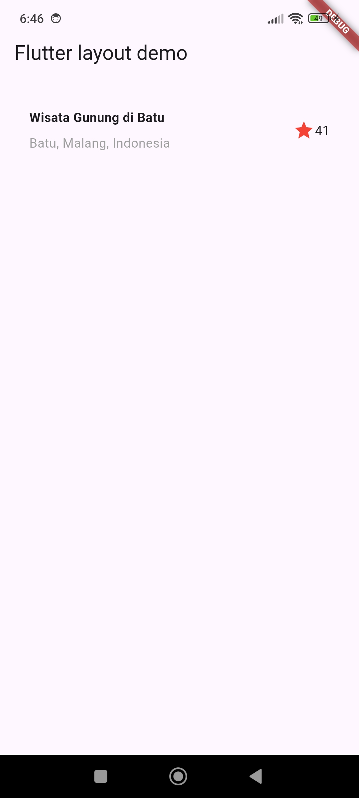
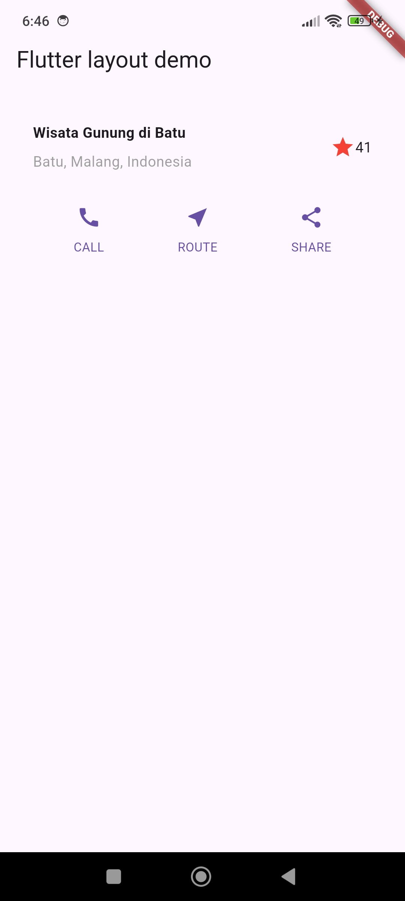
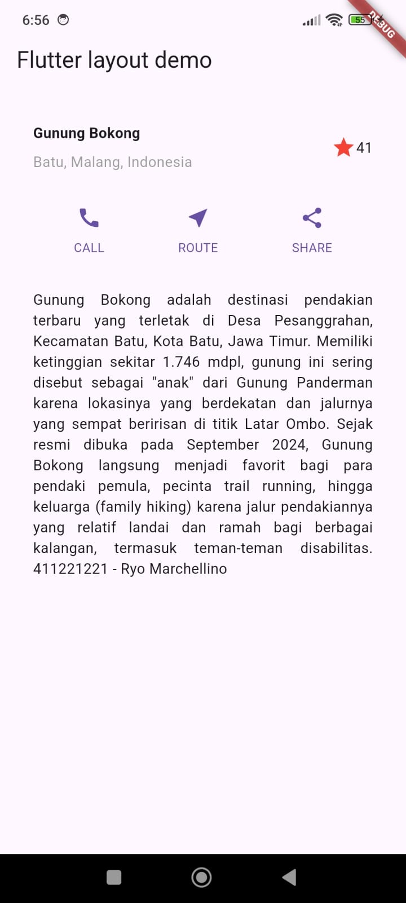
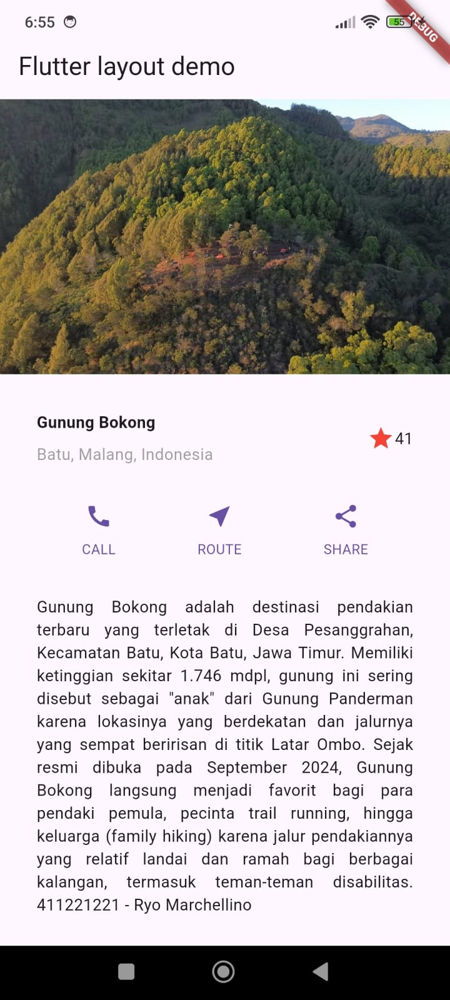

# layout_flutter

 \
Pembuatan container titleSection yang berisi baris, dengan 3 *children* yaitu Expanded, Icon, dan Text. dalam Expanded terdapat column yang berisi Container dan text (Batu, Malang, Indonesia). Container Berisi text (Gunung Bokong).

 \
Pembuatan widget buttonSection yang bersis baris dengan *children* 3 _buildButtonColumn, sebuah fungsi *private* yang mereturn column dengan icon dan text berdasarkan argumen yang diberikan

 \
Pembuatan widget text

 \
Penambahan gambar
